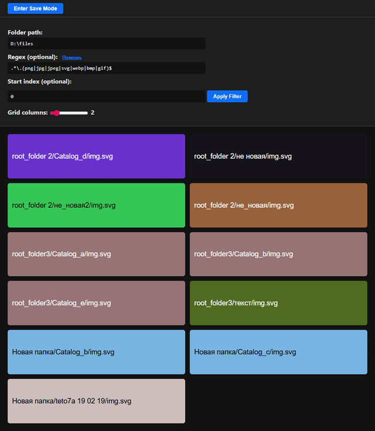

# pgral
pgral (Photo gallery grid app local)  


# run 
1.Download lastest [release](https://github.com/gateway19/pgral/releases/)  \
2. Save to folder \
3. Create shortcut to  
```
PROGRAM_PATH/pgral.exe -u "http://127.0.0.1:8095/?path=C:\Users\username\Downloads\&regex=.*\.(png|jpg|jpeg)$" 
```
OR (for auto update ) 
```
PROGRAM_PATH/updater.exe -u "http://127.0.0.1:8095/?path=C:\Users\username\Downloads\&regex=.*\.(png|jpg|jpeg)$" -v main 
```

# dev 
```cmd
git clone https://github.com/gateway19/pgral/ --branch dev  
cd pgral 
pip install -r requirements.txt 
python main.py 

pyinstaller --onefile --add-data "templates;templates" --name pgral --hidden-import=uvicorn.protocols.http.h11_impl --hidden-import=uvicorn.protocols.websockets.websockets_impl main.py 
go build -o dist/updater.exe main.go
```

# Images

